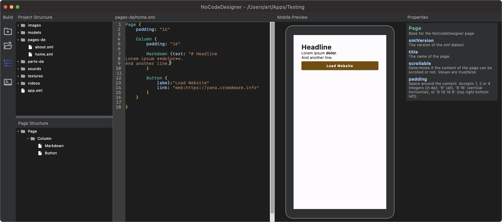

# NoCodeDesigner

A no-code application designer built on the NoCodeLib library.

## Overview

NoCodeDesigner is a desktop application that allows users to design applications without writing code. It uses the NoCodeLib library for core functionality and adds specific features for application design.

## Features

- Visual application design
- Component library
- Preview functionality
- Export to various formats

## Plugins
You will find plugin samples [here](https://github.com/CrowdWare/NoCodeDesignerPlugins).

## Development

NoCodeDesigner is built using Kotlin Multiplatform and Compose for Desktop. It uses NoCodeLib as a shared library.

### Building from Source

1. Clone the repository with submodules:
   ```bash
   git clone --recursive https://github.com/crowdware/NoCodeDesigner.git
   ```

2. Build the project:
   ```bash
   ./gradlew build
   ```

3. Run the application:
   ```bash
   ./gradlew run
   ```

## License

NoCodeDesigner is licensed under the **GNU General Public License v3.0 (GPLv3)**.

You are free to use, modify, and distribute this software under the terms of the GPLv3.  
If you modify the code and distribute it, you must also share your changes under the same license and retain proper attribution to the original author.

### A personal note

I believe technology should be free, empowering, and accessible.  
You're welcome to explore, learn from, and build on this project.

If you use NoCodeDesigner in a commercial context or wish to integrate it into proprietary systems, I kindly ask that you reach out. While the GPL permits commercial use, I value transparency and fair collaboration.

You're not required to contact me — but I always appreciate hearing from people who use or extend this project. Let's grow something meaningful together.

📬 Contact: [artanidos@crowdware.at](mailto:artanidos@crowdware.at)  

